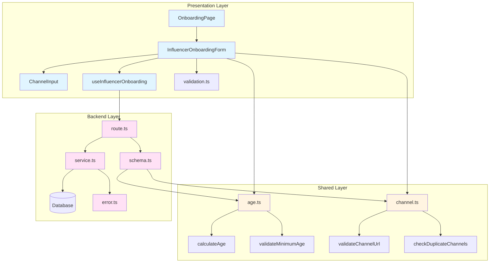

# 모듈화 설계: 인플루언서 정보 등록 (UC-002)

## 개요

유스케이스 002의 요구사항을 충족하기 위한 모듈화 설계입니다. 기존 구현을 개선하고 누락된 기능을 추가합니다.

### 모듈 목록

#### 1. 공통 유틸리티 모듈 (Shared)
- **`src/lib/validation/age.ts`**: 나이 계산 및 검증 유틸리티
- **`src/lib/validation/channel.ts`**: 채널 검증 유틸리티 (URL 패턴 검증 + 중복 검사 통합)

#### 2. 백엔드 모듈 (Backend)
- **`src/features/user/backend/schema.ts`**: Zod 스키마 개선 (나이 검증, URL 패턴 검증, 중복 채널 검증 추가, 채널 상수 포함)
- **`src/features/user/backend/service.ts`**: 비즈니스 로직 개선 (트랜잭션 처리, 중복 프로필 검증, 에러 처리 강화)
- **`src/features/user/backend/error.ts`**: 에러 코드 추가 (나이 제한, 중복 프로필, 중복 채널 등)

#### 3. 프론트엔드 모듈 (Presentation)
- **`src/features/user/components/InfluencerOnboardingForm.tsx`**: 인플루언서 온보딩 폼 컴포넌트 (ChannelInput 포함, 재사용 가능하도록 분리)
- **`src/features/user/hooks/useInfluencerOnboarding.ts`**: 인플루언서 온보딩 훅 (React Query 통합)
- **`src/app/onboarding/[role]/page.tsx`**: 페이지 컴포넌트 (컴포넌트 분리 후 간소화)

## Diagram



## Implementation Plan

### 1. 공통 유틸리티 모듈

#### 1.1 `src/lib/validation/age.ts`
**목적**: 나이 계산 및 검증 로직을 공통 모듈로 분리

**구현 내용**:
- `calculateAge(birthDate: string): number` - 생년월일로부터 만 나이 계산
- `validateMinimumAge(birthDate: string, minimumAge: number): boolean` - 최소 나이 검증
- `MINIMUM_INFLUENCER_AGE = 14` - 상수 정의

**Unit Test**:
```typescript
describe('calculateAge', () => {
  it('should calculate age correctly', () => {
    const birthDate = '2010-01-01';
    const age = calculateAge(birthDate);
    expect(age).toBeGreaterThanOrEqual(14);
  });
});

describe('validateMinimumAge', () => {
  it('should return true for valid age', () => {
    const birthDate = '2010-01-01';
    expect(validateMinimumAge(birthDate, 14)).toBe(true);
  });
  
  it('should return false for underage', () => {
    const birthDate = '2015-01-01';
    expect(validateMinimumAge(birthDate, 14)).toBe(false);
  });
});
```

#### 1.2 `src/lib/validation/channel.ts`
**목적**: 채널 관련 공통 검증 함수 (URL 패턴 검증 + 중복 검사 통합)

**구현 내용**:
- `CHANNEL_URL_PATTERNS` - 채널 유형별 정규식 패턴 맵
- `validateChannelUrl(channelType: string, url: string): boolean` - URL 패턴 검증
- `getChannelUrlPattern(channelType: string): RegExp | null` - 채널 유형별 패턴 반환
- `checkDuplicateChannels(channels: ChannelInput[]): boolean` - 중복 채널 유형 검사

**Unit Test**:
```typescript
describe('validateChannelUrl', () => {
  it('should validate YouTube URL correctly', () => {
    expect(validateChannelUrl('youtube', 'https://www.youtube.com/channel/UCxxx')).toBe(true);
    expect(validateChannelUrl('youtube', 'https://youtu.be/xxx')).toBe(true);
    expect(validateChannelUrl('youtube', 'https://instagram.com/xxx')).toBe(false);
  });
  
  it('should validate Instagram URL correctly', () => {
    expect(validateChannelUrl('instagram', 'https://www.instagram.com/username')).toBe(true);
    expect(validateChannelUrl('instagram', 'https://youtube.com/xxx')).toBe(false);
  });
});

describe('checkDuplicateChannels', () => {
  it('should detect duplicate channel types', () => {
    const channels = [
      { channelType: 'youtube', channelName: 'Channel 1', channelUrl: 'https://youtube.com/1' },
      { channelType: 'youtube', channelName: 'Channel 2', channelUrl: 'https://youtube.com/2' },
    ];
    expect(checkDuplicateChannels(channels)).toBe(true);
  });
  
  it('should return false for unique channels', () => {
    const channels = [
      { channelType: 'youtube', channelName: 'Channel 1', channelUrl: 'https://youtube.com/1' },
      { channelType: 'instagram', channelName: 'Channel 2', channelUrl: 'https://instagram.com/2' },
    ];
    expect(checkDuplicateChannels(channels)).toBe(false);
  });
});
```

### 2. 백엔드 모듈

#### 2.1 `src/features/user/backend/schema.ts`
**목적**: Zod 스키마에 비즈니스 규칙 검증 추가 및 채널 상수 정의

**구현 내용**:
- 채널 관련 상수 정의:
  - `CHANNEL_TYPES` - 채널 유형 배열
  - `CHANNEL_TYPE_LABELS` - 채널 유형 라벨 맵
  - `MINIMUM_INFLUENCER_AGE` - 최소 나이 상수
- `InfluencerOnboardingSchema` 개선:
  - `birthDate`에 나이 검증 추가 (`.refine()` 사용)
  - `channels` 배열에 중복 채널 유형 검증 추가
  - 각 채널의 `channelUrl`에 채널 유형별 URL 패턴 검증 추가

**변경 사항**:
```typescript
export const InfluencerOnboardingSchema = z.object({
  birthDate: z.string()
    .regex(/^\d{4}-\d{2}-\d{2}$/, '올바른 날짜 형식을 입력해주세요.')
    .refine((date) => validateMinimumAge(date, MINIMUM_INFLUENCER_AGE), {
      message: '만 14세 이상만 가입 가능합니다.',
    }),
  channels: z.array(
    z.object({
      channelType: z.enum(['naver', 'youtube', 'instagram', 'threads']),
      channelName: z.string().min(1, '채널명을 입력해주세요.'),
      channelUrl: z.string()
        .url('올바른 URL을 입력해주세요.')
        .refine((url, ctx) => {
          const channelType = ctx.parent.channelType;
          return validateChannelUrl(channelType, url);
        }, {
          message: '채널 유형에 맞는 URL을 입력해주세요.',
        }),
    })
  )
    .min(1, '최소 1개 이상의 SNS 채널을 등록해주세요.')
        .refine((channels) => !checkDuplicateChannels(channels), {
          message: '동일한 채널 유형을 중복으로 등록할 수 없습니다.',
        }),
});

// 채널 관련 상수
export const CHANNEL_TYPES = ['naver', 'youtube', 'instagram', 'threads'] as const;
export type ChannelType = typeof CHANNEL_TYPES[number];

export const CHANNEL_TYPE_LABELS: Record<ChannelType, string> = {
  naver: '네이버 블로그',
  youtube: 'YouTube',
  instagram: 'Instagram',
  threads: 'Threads',
};

export const MINIMUM_INFLUENCER_AGE = 14;
```

**Unit Test**:
```typescript
describe('InfluencerOnboardingSchema', () => {
  it('should reject underage users', () => {
    const input = {
      birthDate: '2015-01-01',
      channels: [{ channelType: 'youtube', channelName: 'Test', channelUrl: 'https://youtube.com/test' }],
    };
    const result = InfluencerOnboardingSchema.safeParse(input);
    expect(result.success).toBe(false);
  });
  
  it('should reject duplicate channel types', () => {
    const input = {
      birthDate: '2000-01-01',
      channels: [
        { channelType: 'youtube', channelName: 'Test1', channelUrl: 'https://youtube.com/test1' },
        { channelType: 'youtube', channelName: 'Test2', channelUrl: 'https://youtube.com/test2' },
      ],
    };
    const result = InfluencerOnboardingSchema.safeParse(input);
    expect(result.success).toBe(false);
  });
  
  it('should reject invalid URL pattern', () => {
    const input = {
      birthDate: '2000-01-01',
      channels: [{ channelType: 'youtube', channelName: 'Test', channelUrl: 'https://instagram.com/test' }],
    };
    const result = InfluencerOnboardingSchema.safeParse(input);
    expect(result.success).toBe(false);
  });
});
```

#### 2.2 `src/features/user/backend/service.ts`
**목적**: 트랜잭션 처리 및 중복 프로필 검증 추가

**구현 내용**:
- `createInfluencerProfile` 함수 개선:
  - 기존 프로필 존재 여부 확인 로직 추가
  - Supabase 트랜잭션 처리 (RPC 함수 또는 단일 쿼리로 통합)
  - 에러 발생 시 롤백 처리

**변경 사항**:
```typescript
export const createInfluencerProfile = async (
  client: SupabaseClient,
  userId: string,
  input: InfluencerOnboardingInput,
): Promise<HandlerResult<{ profileId: string }, UserServiceError, unknown>> => {
  // 기존 프로필 확인
  const { data: existingProfile } = await client
    .from(INFLUENCER_PROFILES_TABLE)
    .select('id')
    .eq('user_id', userId)
    .maybeSingle();
  
  if (existingProfile) {
    return failure(409, userErrorCodes.duplicateProfile, '이미 인플루언서 프로필이 존재합니다.');
  }
  
  // 트랜잭션 처리: 프로필과 채널을 원자적으로 생성
  const { data: profileData, error: profileError } = await client
    .from(INFLUENCER_PROFILES_TABLE)
    .insert({
      user_id: userId,
      birth_date: input.birthDate,
      profile_completed: true,
    })
    .select('id')
    .single();
  
  if (profileError || !profileData) {
    return failure(500, userErrorCodes.createError, profileError?.message ?? 'Failed to create influencer profile');
  }
  
  // 채널 생성
  if (input.channels.length > 0) {
    const channelsToInsert = input.channels.map((channel) => ({
      influencer_profile_id: profileData.id,
      channel_type: channel.channelType,
      channel_name: channel.channelName,
      channel_url: channel.channelUrl,
      verification_status: 'pending' as const,
    }));
    
    const { error: channelsError } = await client
      .from(INFLUENCER_CHANNELS_TABLE)
      .insert(channelsToInsert);
    
    if (channelsError) {
      // 채널 생성 실패 시 프로필도 롤백 (수동 삭제)
      await client.from(INFLUENCER_PROFILES_TABLE).delete().eq('id', profileData.id);
      return failure(500, userErrorCodes.createError, channelsError.message);
    }
  }
  
  return success({ profileId: profileData.id });
};
```

**Unit Test**:
```typescript
describe('createInfluencerProfile', () => {
  it('should reject duplicate profile creation', async () => {
    const mockClient = createMockSupabaseClient();
    mockClient.from.mockReturnValueOnce({
      select: jest.fn().mockReturnThis(),
      eq: jest.fn().mockReturnThis(),
      maybeSingle: jest.fn().mockResolvedValue({ data: { id: 'existing-id' } }),
    });
    
    const result = await createInfluencerProfile(mockClient, 'user-id', validInput);
    expect(result.ok).toBe(false);
    expect(result.error.code).toBe('DUPLICATE_PROFILE');
  });
  
  it('should rollback on channel creation failure', async () => {
    const mockClient = createMockSupabaseClient();
    // 프로필 생성 성공, 채널 생성 실패 시나리오
    // 프로필 삭제 호출 확인
  });
});
```

#### 2.3 `src/features/user/backend/error.ts`
**목적**: 새로운 에러 코드 추가

**구현 내용**:
```typescript
export const userErrorCodes = {
  // ... 기존 코드
  duplicateProfile: 'DUPLICATE_PROFILE',
  ageRestriction: 'AGE_RESTRICTION',
  invalidChannelUrl: 'INVALID_CHANNEL_URL',
  duplicateChannelType: 'DUPLICATE_CHANNEL_TYPE',
} as const;
```

### 3. 프론트엔드 모듈

#### 3.1 `src/features/user/components/InfluencerOnboardingForm.tsx`
**목적**: 인플루언서 온보딩 폼을 재사용 가능한 컴포넌트로 분리 (ChannelInput 포함)

**구현 내용**:
- 폼 상태 관리
- 채널 추가/삭제 로직
- 채널 입력 컴포넌트 (내부 컴포넌트로 포함)
- 클라이언트 측 실시간 검증 (공통 모듈 직접 사용)
- 에러 메시지 표시
- `useInfluencerOnboarding` 훅 연동

**QA Sheet**:
- [ ] 생년월일 입력 시 나이 검증이 실시간으로 동작하는가?
- [ ] 채널 URL 입력 시 채널 유형별 패턴 검증이 동작하는가?
- [ ] 채널 유형 변경 시 URL 검증이 재실행되는가?
- [ ] 동일한 채널 유형을 추가하려 할 때 경고 메시지가 표시되는가?
- [ ] 최소 1개 이상의 채널이 없으면 제출 버튼이 비활성화되는가?
- [ ] 네트워크 오류 시 재시도 옵션이 제공되는가?
- [ ] 로딩 상태가 명확하게 표시되는가?
- [ ] 성공 시 홈 페이지로 리다이렉트되는가?
- [ ] 접근성: 키보드 네비게이션이 가능한가?
- [ ] 반응형: 모바일에서도 사용하기 편한가?

#### 3.2 `src/features/user/hooks/useInfluencerOnboarding.ts`
**목적**: React Query를 사용한 온보딩 뮤테이션 훅

**구현 내용**:
- `useMutation`을 사용한 API 호출
- 성공/실패 처리
- 쿼리 무효화 (프로필 관련 쿼리)
- 에러 메시지 추출

**구현 예시**:
```typescript
export const useInfluencerOnboarding = () => {
  const queryClient = useQueryClient();
  const router = useRouter();
  
  return useMutation({
    mutationFn: async (input: InfluencerOnboardingInput & { userId: string }) => {
      const { data } = await apiClient.post('/api/users/onboarding/influencer', input);
      return data;
    },
    onSuccess: () => {
      queryClient.invalidateQueries({ queryKey: ['user', 'profile'] });
      router.replace('/');
    },
    onError: (error) => {
      // 에러 처리
    },
  });
};
```

#### 3.3 `src/app/onboarding/[role]/page.tsx`
**목적**: 페이지 컴포넌트 간소화

**구현 내용**:
- 컴포넌트 분리 후 간소화
- 역할별 분기 처리만 담당
- 인플루언서의 경우 `InfluencerOnboardingForm` 사용

**QA Sheet**:
- [ ] 인플루언서 역할일 때 올바른 폼이 표시되는가?
- [ ] 광고주 역할일 때 올바른 폼이 표시되는가?
- [ ] 로그인하지 않은 사용자는 로그인 페이지로 리다이렉트되는가?
- [ ] 잘못된 역할 경로 접근 시 404가 표시되는가?

## 구현 우선순위

1. **Phase 1**: 공통 유틸리티 모듈 (age.ts, channel.ts)
2. **Phase 2**: 백엔드 스키마 및 서비스 개선 (schema.ts에 상수 포함, service.ts, error.ts)
3. **Phase 3**: 프론트엔드 컴포넌트 분리 (InfluencerOnboardingForm, useInfluencerOnboarding)
4. **Phase 4**: 페이지 간소화 (page.tsx)

## 참고사항

- 모든 공통 모듈은 순수 함수로 작성하여 테스트 용이성 확보
- 트랜잭션 처리는 Supabase의 제약사항을 고려하여 구현 (RPC 함수 또는 수동 롤백)
- 프론트엔드 검증은 공통 모듈(`src/lib/validation/`)을 직접 사용하여 중복 제거
- 채널 관련 상수는 `schema.ts`에 포함하여 관련 로직과 함께 관리
- `ChannelInput`은 우선 `InfluencerOnboardingForm` 내부 컴포넌트로 구현, 재사용 필요 시 분리
- 에러 메시지는 사용자 친화적으로 작성

## 모듈 통합 요약

**제거/통합된 모듈**:
- ❌ `src/lib/validation/url-pattern.ts` → `channel.ts`에 통합
- ❌ `src/features/user/lib/validation.ts` → 공통 모듈 직접 사용
- ❌ `src/features/user/constants/channels.ts` → `schema.ts`에 포함
- ❌ `src/features/user/components/ChannelInput.tsx` → `InfluencerOnboardingForm.tsx` 내부 포함

**최종 모듈 수**: 12개 → **9개** (25% 감소)
