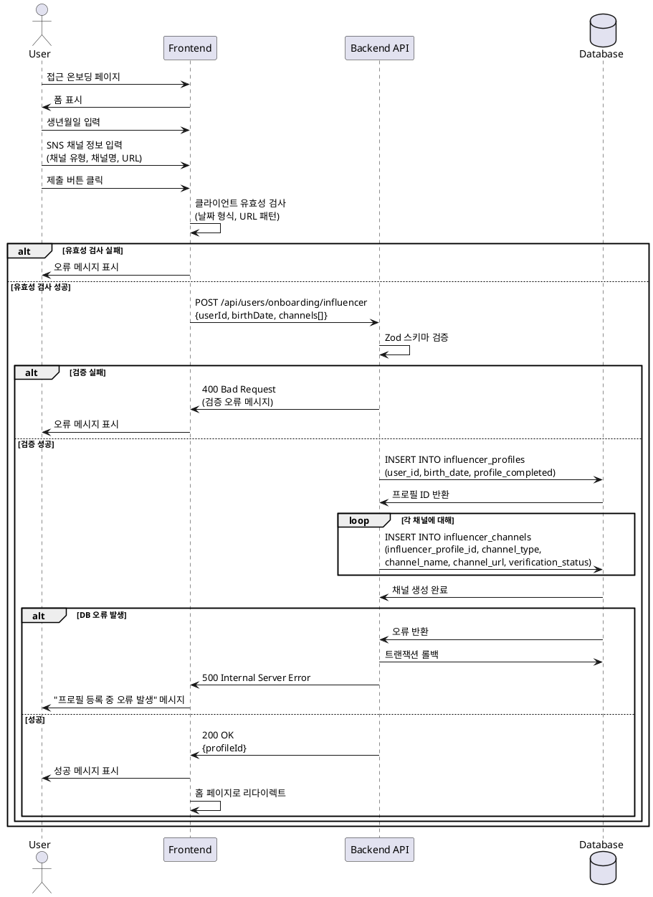

# 유스케이스 002: 인플루언서 정보 등록

## Primary Actor
인플루언서 (회원가입 시 역할을 인플루언서로 선택한 사용자)

## Precondition
1. 사용자가 회원가입을 완료하고 인플루언서 역할을 선택한 상태
2. 사용자가 `/onboarding/influencer` 페이지에 접근 가능한 상태
3. 사용자가 로그인되어 있고 인증된 상태

## Trigger
사용자가 회원가입 후 인플루언서 온보딩 페이지에 접근하거나, 온보딩 폼을 제출할 때

## Main Scenario

1. 사용자가 인플루언서 온보딩 페이지에 접근
2. 시스템이 폼을 표시 (생년월일, SNS 채널 입력 필드)
3. 사용자가 생년월일을 입력
4. 사용자가 SNS 채널 정보를 추가 (채널 유형: Naver, YouTube, Instagram, Threads 중 선택)
   - 각 채널에 대해 채널명과 URL 입력
   - 필요시 여러 채널 추가 가능
5. 사용자가 "제출" 버튼 클릭
6. 프론트엔드가 입력 데이터 유효성 검사 수행
   - 생년월일 형식 검증 (YYYY-MM-DD)
   - 나이 정책 검증 (만 14세 이상)
   - 채널 URL 형식 검증
   - 채널 유형별 URL 패턴 매칭
7. 프론트엔드가 백엔드 API로 POST 요청 전송 (`/api/users/onboarding/influencer`)
8. 백엔드가 요청 데이터 유효성 검사 (Zod 스키마 검증)
9. 백엔드가 데이터베이스에 `influencer_profiles` 레코드 생성
   - `user_id`: 현재 사용자 ID
   - `birth_date`: 입력된 생년월일
   - `profile_completed`: true
10. 백엔드가 입력된 각 SNS 채널에 대해 `influencer_channels` 레코드 생성
    - `influencer_profile_id`: 생성된 프로필 ID
    - `channel_type`: 채널 유형 (naver, youtube, instagram, threads)
    - `channel_name`: 채널명
    - `channel_url`: 채널 URL
    - `verification_status`: 'pending' (검증 대기 상태)
11. 백엔드가 성공 응답 반환 (프로필 ID 포함)
12. 프론트엔드가 성공 메시지 표시
13. 시스템이 사용자를 홈 페이지로 리다이렉트
14. 이후 사용자는 체험단 지원 기능을 사용할 수 있음

## Edge Cases

### EC1: 생년월일 형식 오류
- **조건**: 생년월일이 YYYY-MM-DD 형식이 아님
- **처리**: 프론트엔드에서 즉시 오류 메시지 표시, 제출 불가

### EC2: 나이 정책 위반
- **조건**: 만 14세 미만인 경우
- **처리**: 백엔드에서 검증 실패, 400 에러 반환, "만 14세 이상만 가입 가능합니다" 메시지 표시

### EC3: 채널 URL 형식 오류
- **조건**: 채널 유형에 맞지 않는 URL 형식 (예: YouTube 채널에 Instagram URL 입력)
- **처리**: 프론트엔드에서 URL 패턴 검증 실패 시 오류 메시지 표시, 제출 불가

### EC4: 중복 채널 유형
- **조건**: 동일한 채널 유형을 여러 번 추가 시도
- **처리**: 프론트엔드에서 중복 추가 방지 또는 백엔드에서 유니크 제약조건으로 처리

### EC5: 데이터베이스 오류
- **조건**: 프로필 또는 채널 생성 중 DB 오류 발생
- **처리**: 백엔드에서 500 에러 반환, "프로필 등록 중 오류가 발생했습니다" 메시지 표시, 트랜잭션 롤백

### EC6: 이미 프로필이 존재하는 경우
- **조건**: 해당 사용자 ID로 이미 인플루언서 프로필이 존재
- **처리**: 백엔드에서 중복 생성 방지 또는 기존 프로필 업데이트 처리

### EC7: 네트워크 오류
- **조건**: API 요청 중 네트워크 연결 실패
- **처리**: 프론트엔드에서 네트워크 오류 메시지 표시, 재시도 옵션 제공

### EC8: 인증되지 않은 사용자
- **조건**: 로그인하지 않은 상태에서 접근 시도
- **처리**: 시스템이 로그인 페이지로 리다이렉트

## Business Rules

1. **나이 제한**: 만 14세 이상만 인플루언서로 등록 가능
2. **채널 유형**: 지원되는 채널 유형은 Naver, YouTube, Instagram, Threads 4가지
3. **채널 검증**: 모든 채널은 등록 시 'pending' 상태로 시작하며, 이후 비동기 검증 프로세스 진행
4. **프로필 완성도**: 생년월일과 최소 1개 이상의 채널이 등록되어야 프로필 완성으로 간주
5. **체험단 지원 권한**: 프로필이 완성된 인플루언서만 체험단에 지원 가능
6. **채널 URL 패턴**: 각 채널 유형별로 유효한 URL 패턴이 존재 (예: YouTube는 youtube.com 또는 youtu.be 도메인)
7. **트랜잭션**: 프로필 생성과 채널 생성은 원자적으로 처리되어야 하며, 하나라도 실패하면 전체 롤백

## Sequence Diagram

